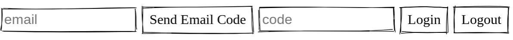

# Passwordless Minimal Example
The most minimal Auth 0 passwordless example I could create. You will have to:
* create an Auth 0 SPA app
* get the client ID and domain and plug into index.html
* create an email connection
* turn the email connection on in your application
* add wherever you plan to run this example into the redirectUri, callback, and origin list of your application
